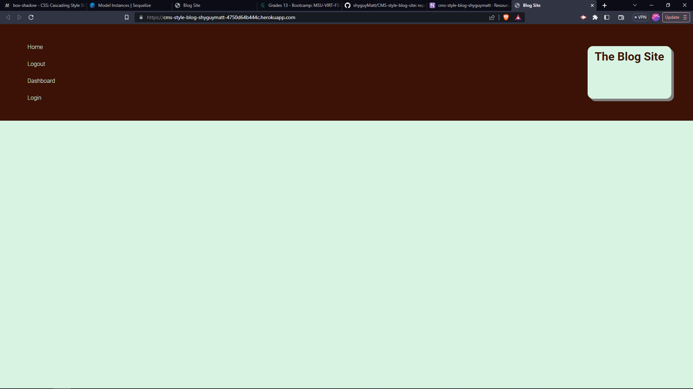

# CMS-style-blog-site
The goal for this assingnment was to create a blog app. Requirements being that on the homepage a list of blog posts is listed, loaded from a database. there is to be a login page that would create a session for the user, giving them access to a dashboard where you can create new posts. On the home page if while you are logged in you can create a comment for the post that would include the users name and the date that the comment was posted.

## Screenshots

## Github
[https://github.com/shyguyMatt/CMS-style-blog-site]